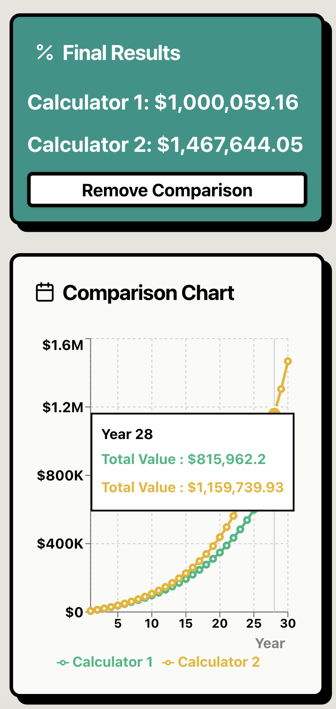

> [!TIP]
> "Compound interest is the eighth wonder of the world. He who understands it, earns it. He who doesn't, pays it" - Albert Einstein

## Better Compound Interest Calculator

This is a compound interest calculator helps you see the magic of compounding in action. And directly compare two different compounding scenarios.

## Try it now!
[https://compounding.vercel.app/](https://compounding.vercel.app/)

## Screenshots

  
  
  

